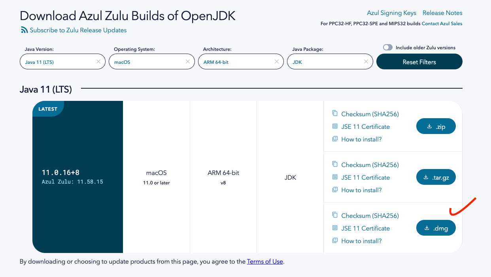
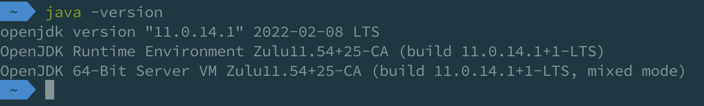
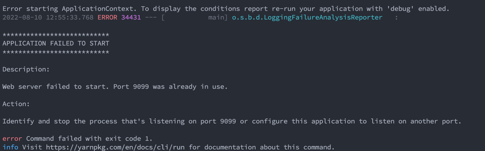
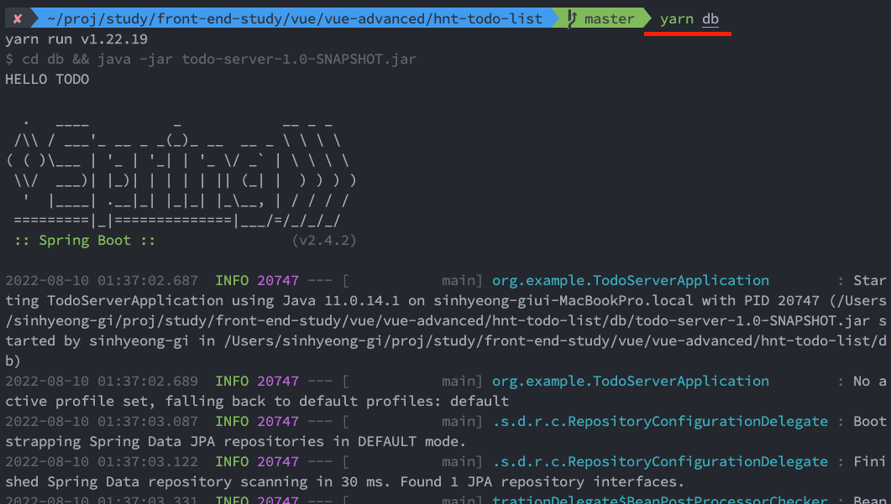
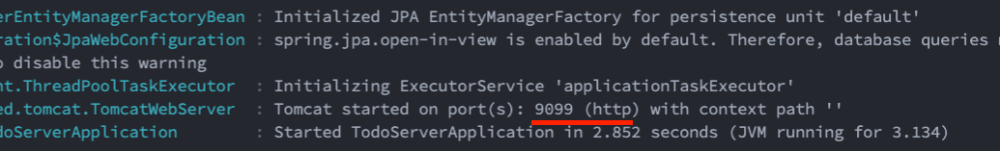
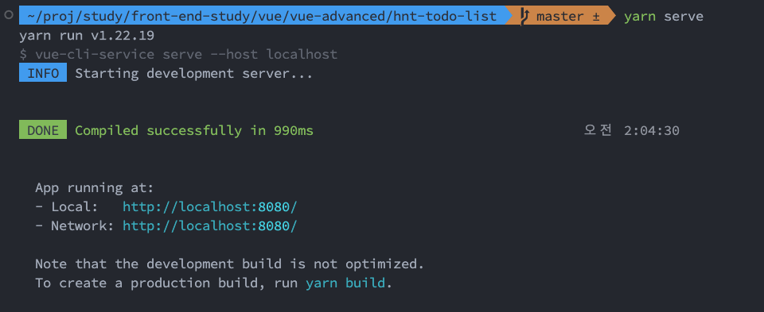

### 1 주차 과제
---
src/components 하위에 TodoInput, TodoItem 파일이 있습니다.
해당 vue 파일의 부모 컴포넌트는 App.vue 입니다 :)

> https://github.com/hanatour-blog/vue-ts 에서 fork 를 해주시고,
- 개인 브런치 를 생성합니다. 
- 브런치 네이밍은 통일되게 hnt-영문이름 으로 만들어주세요 ! 
    - ex) hnt-shinhyungki

> ! 중요 ! in memory db 사용 방법은 사전에 java 가 설치되어 있어야 합니다.
- 아래 사이트에서 .dmg파일을 다운받아 실행해서 Java 설치를 진행해주세요 !

https://www.azul.com/downloads/?version=java-11-lts&os=macos&architecture=arm-64-bit&package=jdk#download-openjdk



그런다음 terminal 에서 java -version 명령어를 입력하면 아래 이미지 처럼 version 이 출력되면 자바 설치 끝 ! 



1. 설치가 완료되면 clone 받은 repository 에서 프로젝트를 열어주세요 :)
2. 그런다음 터미널을 켜주시고 $ yarn db 를 입력 해 주세요.

> 혹시나 9099 포트가 이미 떠있는경우 9099 포트를 kill 하세요 :)


```
$ kill $(lsof -t -i:9099)
```





### 위와 같이 spring 배너가 노출되고 port 까지 띄워졌다면, 메모리 db 띄우기 성공 ! ( 포트는 노출되는 것처럼 9099 입니다 :) )


> api spec 은 어떻게 되나요 ..? 호출을 어떻게 해야할지 잘 모르겠어요
> - md 파일 하위에 todo-list json 을 첨부해 놓았어요 ! postman 으로 import 해서 테스트 하시면 됩니다 

1. yarn serve 로 프론트 서버 도 띄워보자.



### 셋팅 완료 ! 이제 과제를 진행 ! 

CRUD 를 만들어 보자.
- [] 할일 입력란 에 할일을 입력후 추가 버튼을 누르면 List 에 할일이 추가되어야 한다
- [] 추가후 입력란 (input) 은 초기화 "" 처리가 되어야 한다.
- [] 추가된 할일 목록중 특정 할일을 선택시 Done (취소선) 기능이 되어야한다.
- [] 삭세 버튼 선택시 선택한 할일이 목록에서 제거되어야 한다.
